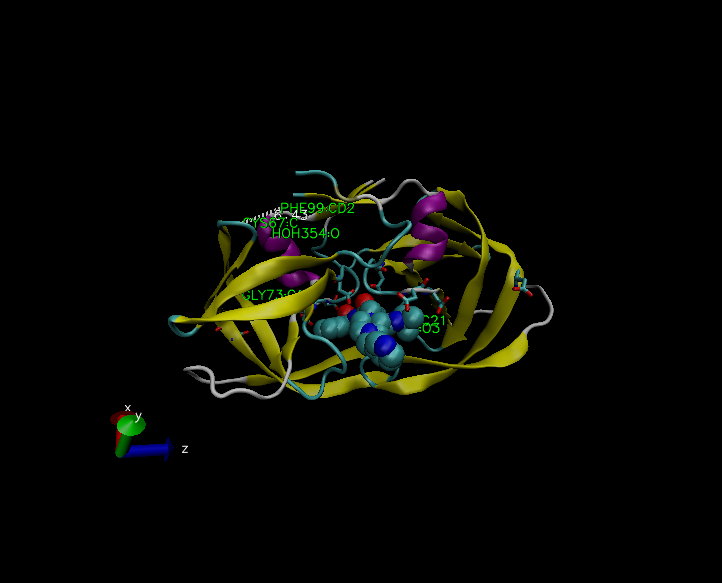
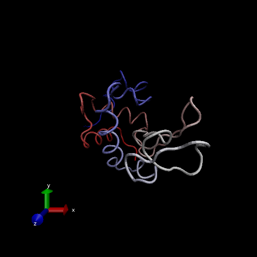

```{r setup, include=FALSE}
knitr::opts_chunk$set(echo = TRUE)
```

Download a CSV file from the PDB site (accessible from "Analyze" \> "PDB Statistics" \> "by Experimental Method and Molecular Type". Move this CSV file into your RStudio project and use it to answer the following questions:

> Q1: What percentage of structures in the PDB are solved by X-Ray and Electron Microscopy.

```{r}
dataexport<-"DataExport.csv"
db<-read.csv(dataexport,row.names = 1)
head(db)
```

```{r}
xray<-db$X.ray
em<-db$EM
total<-db$Total

((sum(xray)+sum(em))/sum(total))*100

method.sums<-colSums(db)
round((method.sums/method.sums["Total"])*100,2)


```

> Q2: What proportion of structures in the PDB are protein?

```{r}
#type.sums <- rowSums(db)
#round((type.sums[1]/method.sums["Total"]),2)
round((db$Total/method.sums["Total"])*100,2)

```

> Q3: Type HIV in the PDB website search box on the home page and determine how many HIV-1 protease structures are in the current PDB?

183581 HIV-1 protease structres in the current PDB

#The PDB format

```{r}
#Alternatively, you can examine the contents of your downloaded file in a suitable text editor or use the Terminal tab from within RStudio (or your favorite Terminal/Shell) and try the following command:

#less ~/Downloads/1hsg.pdb         ## (use ‘q’ to quit)
```

#2. Visualizing the HIV-1 protease structure

> Q4: Water molecules normally have 3 atoms. Why do we see just one atom per water molecule in this structure?

-   We selected and displayed all water molecules as red spheres

> Q5: There is a conserved water molecule in the binding site. Can you identify this water molecule? What residue number does this water molecule have (see note below)?

-   The water molecule is MK1902

```{r}
#install.packages("bio3d")
library(bio3d)
##   Note: Accessing on-line PDB file
pdb <- read.pdb("1hsg")
print(pdb)


```

```{r}
attributes(pdb)
```

```{r}
head(pdb$atom)
```



> Q6: As you have hopefully observed HIV protease is a homodimer (i.e. it is composed of two identical chains). With the aid of the graphic display and the sequence viewer extension can you identify secondary structure elements that are likely to only form in the dimer rather than the monomer?

-   The secondary structures in the purple region are likely to form a dimer rather than the monomer

#3. Introduction to Bio3D in R

Using the bio3d package

```{r}
library(bio3d)

pdb <- read.pdb("1hel")
pdb
```

> Q7: How many amino acid residues are there in this pdb object?

-198

> Q8: Name one of the two non-protein residues?

-HOH

> Q9: How many protein chains are in this structure?

-2

```{r}
attributes(pdb)
```

```{r}
head(pdb$atom)
```

#4.Comparative analysis of protein structure

```{r}
# Install packages in the R console not your Rmd

#install.packages("bio3d")
#install.packages("ggplot2")
#install.packages("ggrepel")
#install.packages("devtools")
#install.packages("BiocManager")

#BiocManager::install("msa")
#devtools::install_bitbucket("Grantlab/bio3d-view")
```

> Q10. Which of the packages above is found only on BioConductor and not CRAN?

-   msa

> Q11. Which of the above packages is not found on BioConductor or CRAN?:

-Grantlab/bio3d-view

> Q12. True or False? Functions from the devtools package can be used to install packages from GitHub and BitBucket?

-TRUE

Let's use a mathematics method called NMA (Normal Made Analysis) to predict the dynamics (flexibility) of this enzyme.

```{r}

modes<-nma(pdb)
plot(modes)
```

Make a "movie" of its predicted motion.We often call this a "trajectory"

```{r}
mktrj(modes, file="nma.pdb")
```

##Search and retrieve ADK structures

```{r}
library(bio3d)
aa <- get.seq("1ake_A")
aa
```

> Q13. How many amino acids are in this sequence, i.e. how long is this sequence?

-214

```{r}
# Blast or hmmer search 
#blast<-blast.pdb(aa)

```

```{r}
hits <- NULL
hits$pdb.id <- c('1AKE_A','4X8M_A','6S36_A','6RZE_A','4X8H_A','3HPR_A','1E4V_A','5EJE_A','1E4Y_A','3X2S_A','6HAP_A','6HAM_A','4K46_A','4NP6_A','3GMT_A','4PZL_A')
```

```{r}
# Plot a summary of search results
#hits <- plot(b)
```

```{r}
# List out some 'top hits'
head(hits$pdb.id)
```

```{r}
# Download releated PDB files
files <- get.pdb(hits$pdb.id, path="pdbs", split=TRUE, gzip=TRUE)
```

##Align and superpose structures

```{r}
# Align releated PDBs
pdbs <- pdbaln(files, fit = TRUE)#, exefile="msa")
#pdbs
```

#PCA

We will use the bio3d pca() function which is designed for protein structure data

```{r}
# Vector containing PDB codes for figure axis
ids <- basename.pdb(pdbs$id)

# Draw schematic alignment
plot(pdbs, labels=ids)
```

#Viewing our superposed structures

```{r}
library(bio3d.view)
library(rgl)

view.pdbs(pdbs)
```

#Annotate collected PDB structures \[Optional\]

```{r}
#anno <- pdb.annotate(ids)
#unique(anno$source)
```

```{r}
#anno
```

#Principal component analysis

```{r}
# Perform PCA
pc.xray <- pca(pdbs)
plot(pc.xray)
```

```{r}
# Calculate RMSD
rd <- rmsd(pdbs)

# Structure-based clustering
hc.rd <- hclust(dist(rd))
grps.rd <- cutree(hc.rd, k=3)

plot(pc.xray, 1:2, col="grey50", bg=grps.rd, pch=21, cex=1)
```

#Optional further visualization



```{r}
#Visualize first principal component
pc1<-mktrj(pc.xray, pc=1, file="pc_1.pdb")
```

```{r}
view.xyz(pc1)
## Potential all C-alpha atom structure(s) detected: Using calpha.connectivity()
```

```{r}
view.xyz(pc1, col=vec2color( rmsf(pc1) ))
## Potential all C-alpha atom structure(s) detected: Using calpha.connectivity()
```

We can also plot our main PCA results with ggplot:

```{r}
#Plotting results with ggplot2
library(ggplot2)
library(ggrepel)

df <- data.frame(PC1=pc.xray$z[,1], 
                 PC2=pc.xray$z[,2], 
                 col=as.factor(grps.rd),
                 ids=ids)

p <- ggplot(df) + 
  aes(PC1, PC2, col=col, label=ids) +
  geom_point(size=2) +
  geom_text_repel(max.overlaps = 20) +
  theme(legend.position = "none")
p

```

#6. Normal mode analysis

```{r}
# NMA of all structures
modes <- nma(pdbs)
```

```{r}
plot(modes, pdbs, col=grps.rd)
```

> Q14. What do you note about this plot? Are the black and colored lines similar or different? Where do you think they differ most and why?

-   the graph depicts two conformation states
-   the black and colored lines are different
-   they differ from the low frequency displacement of two nucleotide binding regions showing the distinct nucleotides

