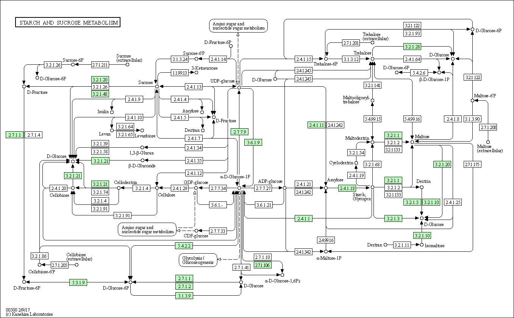
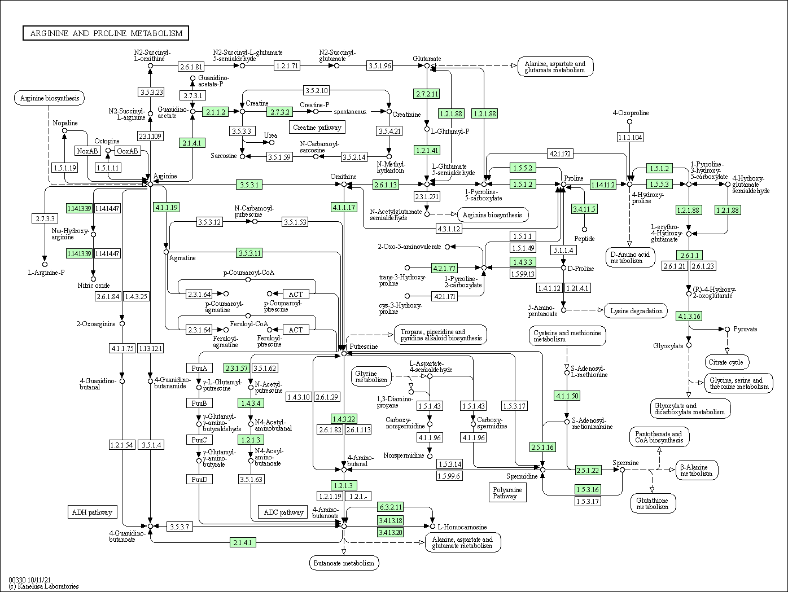

```{r setup, include=FALSE}
knitr::opts_chunk$set(echo = TRUE)
```

##1. Bioconductor and DESeq2 setup

```{r}
#install.packages("BiocManager")
#BiocManager::install()
```

```{r warning=FALSE}
# For this class, you'll also need DESeq2:
#BiocManager::install("DESeq2")
library(BiocManager)
library(DESeq2)
```

##2. Import countData and colData

```{r}
counts <- read.csv("airway_scaledcounts.csv", stringsAsFactors = FALSE, row.names=1)
metadata <-  read.csv("airway_metadata.csv", stringsAsFactors = FALSE)
```

```{r}
head(counts)
```

```{r}
head(metadata)
```

Sanity check on corespondence of counts and metadata

```{r}
metadata$id
colnames(counts)

all(metadata$id==colnames(counts))
```

> Q1. How many genes are in this dataset?

-   there are `r nrow(counts)` genes in the dataset 38694

```{r include=FALSE}
nrow(counts)
```

> Q2. How many 'control' cell lines do we have?

```{r}
n.control<-sum(metadata$dex=="control")
```

there are `r n.control` control cell lines in this dataset

##3. Toy differential gene expression

Extract and summarize the control samples

```{r}
control <- metadata[metadata[,"dex"]=="control",]
control.counts <- counts[ ,control$id]
control.mean <- rowSums( control.counts )/4 
head(control.mean)
```

Extract and summarize the treated (i.e. drug) samples

```{r warning=FALSE}
library(dplyr)
treated <- metadata %>% filter(dex=="treated")
treated.counts <- counts %>% select(treated$id) 
treated.mean <- rowSums(treated.counts)/4
head(treated.mean)
```

> Q3. How would you make the above code in either approach more robust?

add more samples

> Q4. Follow the same procedure for the treated samples (i.e. calculate the mean per gene across drug treated samples and assign to a labeled vector called treated.mean)

```{r}
treated <- metadata[metadata[,"dex"]=="treated",]
treated.mean <- rowSums( counts[ ,treated$id] )/4 
names(treated.mean) <- counts$ensgene
```

Store these results together in a new datafram called `meancounts`

```{r}
meancounts <- data.frame(control.mean, treated.mean)
```

> Q5. Create a scatter plot showing the mean of the treated samples against the mean of the control samples. Your plot should look something like the following.

Lets make a plot to explore the results a little

```{r}
plot(meancounts[,1], meancounts[,2])
```

```{r}
library(ggplot2)

ggplot(meancounts)+
  aes(control.mean, treated.mean) +
  geom_point()
```

> Q6. Try plotting both axes on a log scale. What is the argument to plot() that allows you to do this?

we often use log="xy" and log2 transformations when dealing with this sort of data

We will make a log-log plot to draw out this skewed data data and see what is going on

```{r}
plot(meancounts[,1], meancounts[,2], log="xy",
  xlab="log control counts",ylab="log of trated counts")
```

```{r}
log2(80/200)
```

This log2 transformation has this nice property where if there is no change the log2 value will be zero and if it double the log2 value will be 1 and if halved it ill be -1

So lets add a log2 fold change column to our results so far

```{r}
meancounts$log2fc <-log2 (meancounts$treated.mean / meancounts$control.mean)
```

```{r}
head(meancounts)
```

```{r}
zero.vals <- which(meancounts[,1:2]==0, arr.ind=TRUE)

to.rm <- unique(zero.vals[,1])
mycounts <- meancounts[-to.rm,]
head(mycounts)
```

> Q7. What is the purpose of the arr.ind argument in the which() function call above? Why would we then take the first column of the output and need to call the unique() function?

arr.ind will return the row and column positions with TRUE values. This will call the genes and samples with zero counts.We call the unique() function to ensure that we don't count rows tgat gave zeros in both samples twice.

```{r}
up.ind <- mycounts$log2fc > 2
down.ind <- mycounts$log2fc < (-2)
sum(up.ind)
sum(down.ind)
```

> Q8. Using the up.ind vector above can you determine how many up regulated genes we have at the greater than 2 fc level?

250

> Q9. Using the down.ind vector above can you determine how many down regulated genes we have at the greater than 2 fc level?

367

> Q10. Do you trust these results? Why or why not?

The analysis is done with fold change which can be large with no statistical significance. Without testing the significance we cannot fully trust the results.

##4. DESeq2 analysis

```{r}
library(DESeq2)
citation("DESeq2")
```

Importing data

```{r warning=FALSE}
dds <- DESeqDataSetFromMatrix(countData=counts, 
                              colData=metadata, 
                              design=~dex)
dds
```

DESeq analysis

```{r}
#results(dds)
```

```{r}
dds <- DESeq(dds)
```

Getting results

```{r}
res <- results(dds)
res
```

We can summarize some basic tallies using the summary function.

```{r}
summary(res)
```

```{r}
res05 <- results(dds, alpha=0.05)
summary(res05)
```

##5. Adding annotation data

```{r}
#BiocManager::install("AnnotationDbi")
#BiocManager::install("org.Hs.eg.db")
library("AnnotationDbi")
library("org.Hs.eg.db")
```

```{r}
columns(org.Hs.eg.db)
```

we will use `mapIds` function to translate betweeen identifiers from different databases

```{r message=FALSE}
res$symbol <- mapIds(org.Hs.eg.db,
                     keys=row.names(res), # Our genenames
                     keytype="ENSEMBL",        # The format of our genenames
                     column="SYMBOL",          # The new format we want to add
                     multiVals="first")

```

```{r}
head(res)
```

> Q11. Run the mapIds() function two more times to add the Entrez ID and UniProt accession and GENENAME as new columns called res$entrez, res$uniprot and res\$genename.

```{r message=FALSE}
res$entrez <- mapIds(org.Hs.eg.db,
                     keys=row.names(res),
                     column="ENTREZID",
                     keytype="ENSEMBL",
                     multiVals="first")

res$uniprot <- mapIds(org.Hs.eg.db,
                     keys=row.names(res),
                     column="UNIPROT",
                     keytype="ENSEMBL",
                     multiVals="first")

res$genename <- mapIds(org.Hs.eg.db,
                     keys=row.names(res),
                     column="GENENAME",
                     keytype="ENSEMBL",
                     multiVals="first")

head(res)
```

You can arrange and view the results by the adjusted p-value

```{r}
ord <- order( res$padj )
#View(res[ord,])
head(res[ord,])
```

let's write out the ordered significant results with annotations

```{r}
write.csv(res[ord,], "deseq_results.csv")
```

##6. Data Visualization

Make a summary plot of our results

```{r}
plot( res$log2FoldChange,  -log(res$padj), 
      xlab="Log2(FoldChange)",
      ylab="-Log(P-value)")
```

```{r}
plot( res$log2FoldChange,  -log(res$padj), 
 ylab="-Log(P-value)", xlab="Log2(FoldChange)")

# Add some cut-off lines
abline(v=c(-2,2), col="darkgray", lty=2)
abline(h=-log(0.05), col="darkgray", lty=2)
```

```{r}
# Setup our custom point color vector 
mycols <- rep("gray", nrow(res))
mycols[ abs(res$log2FoldChange) > 2 ]  <- "red" 

inds <- (res$padj < 0.01) & (abs(res$log2FoldChange) > 2 )
mycols[ inds ] <- "blue"

# Volcano plot with custom colors 
plot( res$log2FoldChange,  -log(res$padj), 
 col=mycols, ylab="-Log(P-value)", xlab="Log2(FoldChange)" )

# Cut-off lines
abline(v=c(-2,2), col="gray", lty=2)
abline(h=-log(0.1), col="gray", lty=2)
```

```{r message=FALSE}
#BiocManager::install("EnhancedVolcano")
library(EnhancedVolcano)
```

```{r}
x <- as.data.frame(res)

EnhancedVolcano(x,
    lab = x$symbol,
    x = 'log2FoldChange',
    y = 'pvalue')
```

##7. Pathway analysis

Patway analysis with R and Bioconductor

First we need to do our one time install of these required bioconductor packages:

```{r message=FALSE}
# Run in your R console (i.e. not your Rmarkdown doc!)
#BiocManager::install( c("pathview", "gage", "gageData") )
```

```{r message=FALSE}
library(pathview)
library(gage)
library(gageData)

data(kegg.sets.hs)

# Examine the first 2 pathways in this kegg set for humans
head(kegg.sets.hs, 2)
```

```{r}
foldchanges = res$log2FoldChange
names(foldchanges) = res$entrez
head(foldchanges)
```

Now, let's run the `gage` pathway analysis.

```{r}
# Get the results
keggres = gage(foldchanges, gsets=kegg.sets.hs)
```

Now lets look at the object returned from `gage()`

```{r}
attributes(keggres)
```

Lets look at the first few down (less) pathway results:

```{r}
# Look at the first three down (less) pathways
head(keggres$less, 3)
```

now lets use `pathview()` function from **pathviewa** package to make a pathway plot with out RNA seq expression results shown in color

```{r message=FALSE}
#if (!requireNamespace("BiocManager", quietly = TRUE))
   # install.packages("BiocManager")

#BiocManager::install("pathview", force=TRUE)
```

```{r}
pathview(gene.data=foldchanges, pathway.id="hsa05310")
```


```{r message=FALSE}
# A different PDF based output of the same data
pathview(gene.data=foldchanges, pathway.id="hsa05310", kegg.native=FALSE)
```


> Q12. Can you do the same procedure as above to plot the pathview figures for the top 2 down-reguled pathways?

```{r}
head(keggres$greater , 2)
```

```{r}
pathview(gene.data=foldchanges, pathway.id="hsa00500")
```



```{r}
pathview(gene.data=foldchanges, pathway.id="hsa00330")
```

